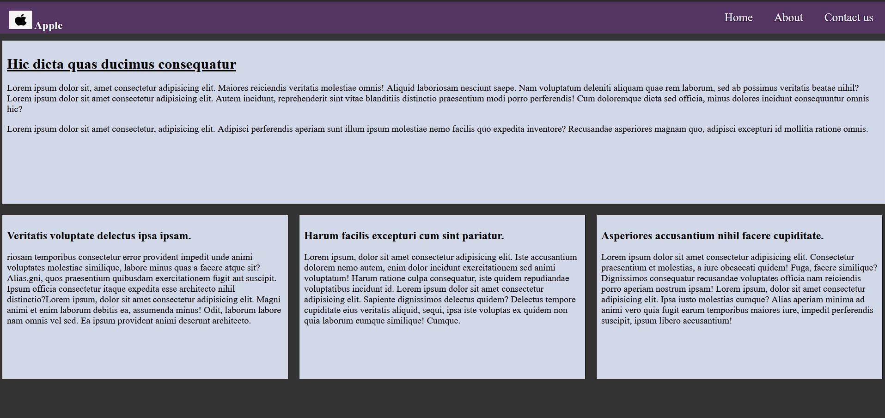
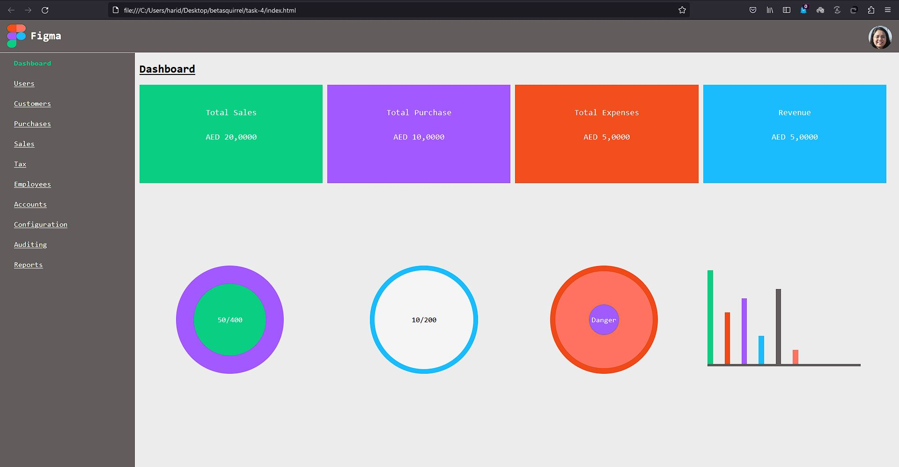

# betasqirrel-task

[LIVE-VIEW](https://haridinesh00.github.io/betasquirrel)

## Links

[Linked-In](https://www.linkedin.com/in/hari-d-816251124/)
[Stackoverflow](https://stackoverflow.com/users/12946676/haridinesh00)
[Github](https://github.com/haridinesh00)
## Tasks

| Requirements                            | Output                           |
| --------------------------------------- | -------------------------------- |
|  |  |
|  |  |
|  |  | 

## Task 3

Read the below links and attend exercises.

- [Home](https://www.w3schools.com/html/default.asp)
- [Introduction](https://www.w3schools.com/html/html_intro.asp)
- [Editors](https://www.w3schools.com/html/html_editors.asp)
- [Basics](https://www.w3schools.com/html/html_basic.asp)
- [Elements](https://www.w3schools.com/html/html_elements.asp)
- [Attributes](https://www.w3schools.com/html/html_attributes.asp)
- [Headings](https://www.w3schools.com/html/html_headings.asp)
- [Paragraphs](https://www.w3schools.com/html/html_paragraphs.asp)
- [Styles](https://www.w3schools.com/html/html_styles.asp)
- [Formatting](https://www.w3schools.com/html/html_formatting.asp)
- [Quotations](https://www.w3schools.com/html/html_quotation_elements.asp)
- [Comments](https://www.w3schools.com/html/html_comments.asp)
- [Colors](https://www.w3schools.com/html/html_colors.asp)
- [CSS](https://www.w3schools.com/html/html_css.asp)
- [Links](https://www.w3schools.com/html/html_links.asp)
- [Images](https://www.w3schools.com/html/html_images.asp)
- [Classes](https://www.w3schools.com/html/html_classes.asp)
- [id](https://www.w3schools.com/html/html_id.asp)
- [favicon](https://www.w3schools.com/html/html_favicon.asp)
- [tables](https://www.w3schools.com/html/html_tables.asp)
- [borders](https://www.w3schools.com/html/html_table_borders.asp)
- [sizes](https://www.w3schools.com/html/html_table_sizes.asp)
- [headers](https://www.w3schools.com/html/html_table_headers.asp)
- [padding](https://www.w3schools.com/html/html_table_padding_spacing.asp)
- [colspan](https://www.w3schools.com/html/html_table_colspan_rowspan.asp)
- [styling](https://www.w3schools.com/html/html_table_styling.asp)
- [colgroup](https://www.w3schools.com/html/html_table_colgroup.asp)

## Linux Commands

- `cd` - Change current directory. Ex: `cd Desktop`, `cd ..` Moves back to parent directory
- `ls` - List contents of a directory. Ex: `ls -al` long list all files.
- `pwd` - Display current working directory path.
- `cat` - Display contents of a file. Ex: `cat README.md`

## Git Commands

1. `git config` - Configure git user. Ex: `git config --global user.name "haridinesh00"`, `git config  --global user.email "haridinesh00@gmail.com"`
2. `git clone` - Clone a remote git repo to your local. Ex: `git clone https://github.com/haridinesh00/betasquirrel.git`, `git clone https://github.com/haridinesh00/betasquirrel.git new-folder`
3. `git add` - Add your file changes to git. Ex: `git add .`, `git add README.md`
4. `git commit` - Commit changes to git. Ex: `git commit -m "Initial commit"
5. `git push` - Push your local commits to remote repo. Ex: `git push origin main`
6. `git pull` - Pull updates your current local working branch. Ex: `git pull new-folder`
7. `git clean` - Removes untracked files from the working directory.
8. `git status` - Displays the state of the working directory and the staged snapshot.
9. `git diff` - This command shows the file differences which are not yet staged.
10. `git show` - This command shows the metadata and content changes of the specified commit.
11. `git stash` - This command temporarily stores all the modified tracked files.

## Task 5

- [HTML Favicon](https://www.w3schools.com/html/html_favicon.asp)
- [HTML Tables](https://www.w3schools.com/html/html_tables.asp)
- [HTML Table Borders](https://www.w3schools.com/html/html_table_borders.asp)
- [HTML Table Sizes](https://www.w3schools.com/html/html_table_sizes.asp)
- [HTML Table Headers](https://www.w3schools.com/html/html_table_headers.asp)
- [HTML Table Padding & Spacing](https://www.w3schools.com/html/html_table_padding_spacing.asp)
- [HTML Table Colspan & Rowspan](https://www.w3schools.com/html/html_table_colspan_rowspan.asp)
- [HTML Table Styling](https://www.w3schools.com/html/html_table_styling.asp)
- [HTML Table Colgroup](https://www.w3schools.com/html/html_table_colgroup.asp)
